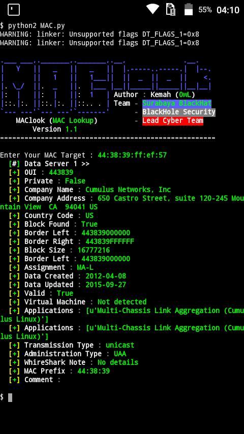

# MAC
MAC Address Lookup
# Install
```bash
$ pkg install git
$ pkg install python2
$ git clone https://github.com/ITermSec/MAC.git
$ cd MAC
$ python2 install.py
```
# Note 
° Percayalah, Merecode tidak akan membuatmu menjadi pro. Semoga anda memahaminya ;)
# Screenshoot

